 

 

## About Me

Machine Learning & Generative AI enthusiast, currently studying Computer Science — I like turning models and prompts into things that actually work.

Most of what I build lives in the Gen AI / ML space: RAG pipelines, document Q&A chatbots, and retrieval systems using Python, FAISS, Qdrant, and Ollama. I also spend time on the fundamentals — regression models, evaluation metrics — because that's what makes the "AI" part actually reliable.

- 🚀 Worked in a startup environment and contributed to developing a web application within a short timeframe
- 🤝 Use GitHub Copilot and Claude regularly to code faster, debug smarter, and ship sooner
- 🐍 Comfortable with Python end-to-end — APIs, testing, and real application code, not just notebooks

Beyond that, I keep my SQL sharp solving problems on HackerRank, and I build data analytics dashboards in Power BI and Excel when a project calls for it — sales analysis, workforce data, that kind of thing.

 

## ⚡ Tech Stack

<table width="90%">
<tr>
<td width="20%"><b>Generative AI</b></td>
<td width="80%">

</td>
</tr>
<tr>
<td><b>Machine Learning</b></td>
<td>

</td>
</tr>
<tr>
<td><b>Data & BI</b></td>
<td>

</td>
</tr>
<tr>
<td><b>Tools</b></td>
<td>

</td>
</tr>
</table>

 

## 📊 GitHub Activity

 

  

 

## 🌱 Currently Learning & Next Up

- Going deeper into Generative AI — agentic workflows and RAG architecture
- Sharpening SQL through daily HackerRank practice
- Building more real-world data analytics projects in Power BI
- Strengthening React for full-stack work
- Looking for chances to contribute to open source

 

## 📫 Connect With Me

